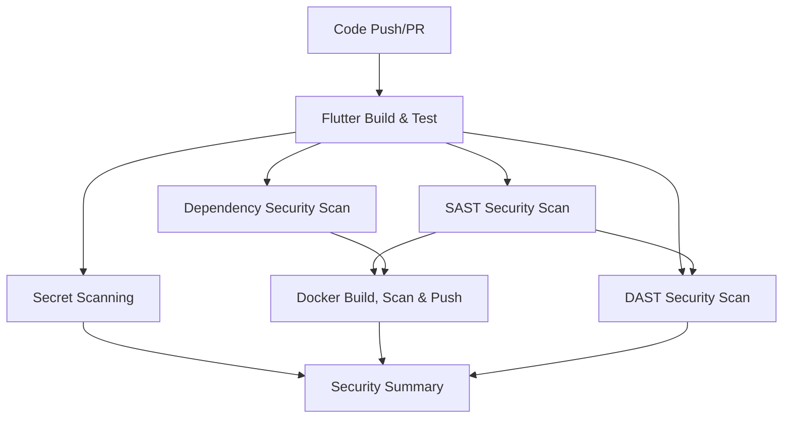

# CI/CD Flutter Project

A comprehensive Flutter project with enterprise-grade CI/CD pipeline, advanced security scanning, code quality gates, and containerization.

## 🚀 CI/CD Pipeline Overview

This project implements a robust CI/CD pipeline using GitHub Actions that automatically builds, tests, scans for security vulnerabilities, and deploys the Flutter application across multiple platforms.

### Pipeline Triggers
- **Push to main branch**: Automatic pipeline execution
- **Pull requests to main**: Validation and testing
- **Manual trigger**: On-demand execution via `workflow_dispatch`

### Pipeline Architecture

The CI/CD pipeline consists of 8 main jobs that run in parallel and sequential order:



## 🔧 Pipeline Jobs

### 1. Flutter Build & Test (`flutter-build-test`)
**Purpose**: Core Flutter application building and testing
- **Runtime**: Ubuntu Latest
- **Flutter Version**: 3.35.5
- **Dart Version**: 3.8.1

**Steps**:
1. **Repository Checkout**: Downloads the latest code
2. **Flutter Setup**: Installs Flutter SDK and verifies installation
3. **Enhanced Caching**: Caches Flutter SDK and dependencies for faster builds
4. **Dependency Installation**: Runs `flutter pub get`
5. **Code Analysis with Quality Gates**: Executes `flutter analyze` with error detection
6. **Testing with Coverage Threshold**: Runs tests with 80% minimum coverage requirement
7. **Optimized Multi-Platform Builds**:
   - Android APK (`flutter build apk --release --split-per-abi --shrink`)
   - Web application (`flutter build web --release --dart-define=FLUTTER_WEB_USE_SKIA=false`)
8. **Artifact Upload**: Stores build artifacts with commit SHA naming

### 2. SAST Security Scan (`sast-scan`)
**Purpose**: Static Application Security Testing using Semgrep
- **Dependencies**: Requires `flutter-build-test` to complete
- **Tool**: Semgrep with CI configuration rules

**Steps**:
1. **Repository Checkout**: Downloads source code
2. **Python Setup**: Installs Python 3.x
3. **Semgrep Rules Caching**: Caches Semgrep rules for faster scans
4. **Semgrep Installation**: Installs Semgrep security scanner
5. **Security Scanning**: Scans code for vulnerabilities using `semgrep --config p/ci`
6. **SARIF Upload**: Uploads results to GitHub Security tab

### 3. Dependency Security Scan (`dependency-scan`)
**Purpose**: Comprehensive dependency vulnerability scanning
- **Dependencies**: Requires `flutter-build-test` (runs in parallel with SAST)
- **Tools**: Trivy + Snyk for dual coverage

**Steps**:
1. **Repository Checkout**: Downloads source code
2. **Flutter Setup**: Installs Flutter SDK for dependency analysis
3. **Enhanced Caching**: Caches Flutter SDK and Trivy vulnerability database
4. **Dependency Installation**: Runs `flutter pub get`
5. **Trivy Scanning**: Scans filesystem for dependency vulnerabilities
6. **Snyk Scanning**: Additional vulnerability scanning with Snyk CLI
7. **License Compliance**: Checks dependency licenses for compliance
8. **SARIF Upload**: Reports findings to GitHub Security tab
9. **Artifact Storage**: Saves scan results for analysis

### 4. Docker Build, Scan & Push (`docker-build-scan-push`)
**Purpose**: Containerizes the Flutter web app and pushes to Docker Hub
- **Dependencies**: Requires `flutter-build-test`, `sast-scan`, and `dependency-scan`
- **Platforms**: Linux AMD64 and ARM64

**Steps**:
1. **Repository Checkout**: Downloads source code
2. **Artifact Download**: Retrieves Flutter build artifacts with commit SHA
3. **Docker Buildx Setup**: Configures multi-platform builds
4. **Docker Hub Login**: Authenticates using secrets
5. **Enhanced Multi-Platform Build**: Builds for AMD64 and ARM64 with aggressive caching
6. **Docker Push**: Pushes images with commit SHA and latest tags
7. **Advanced Docker Caching**: Multi-level caching (GitHub Actions + Registry)
8. **Image Security Scan**: Scans built Docker image with Trivy
9. **SARIF Upload**: Reports container vulnerabilities

**Docker Images Created**:
- `{DOCKER_USERNAME}/flutter-app:{commit-sha}`
- `{DOCKER_USERNAME}/flutter-app:latest`

### 5. DAST Security Scan (`dast-scan`)
**Purpose**: Dynamic Application Security Testing using OWASP ZAP
- **Dependencies**: Requires `flutter-build-test` and `sast-scan`
- **Trigger**: Manual execution only via `workflow_dispatch`

**Steps**:
1. **Repository Checkout**: Downloads source code
2. **Artifact Download**: Retrieves Flutter web build artifacts
3. **Python Setup**: Installs Python 3.x
4. **OWASP ZAP Installation**: Downloads and installs ZAP 2.14.0
5. **ZAP Daemon Start**: Starts ZAP in daemon mode
6. **Web App Serving**: Serves Flutter web app on localhost:8000
7. **Baseline Scan**: Runs ZAP baseline scan against the web app
8. **Result Parsing**: Analyzes scan results and reports severity counts
9. **Pipeline Failure**: Fails pipeline if high-severity issues found
10. **Artifact Upload**: Saves scan results (JSON + XML reports)

### 6. Secret Scanning (`secret-scan`)
**Purpose**: Scans repository for hardcoded secrets and credentials
- **Dependencies**: Requires `flutter-build-test`
- **Tools**: TruffleHog + GitLeaks for comprehensive coverage

**Steps**:
1. **Repository Checkout**: Downloads full git history for scanning
2. **TruffleHog Scan**: Scans repository for verified secrets
3. **GitLeaks Scan**: Additional secret detection with comprehensive patterns
4. **Result Analysis**: Parses JSON results and counts actual secrets
5. **Pipeline Failure**: Fails pipeline if secrets are detected
6. **Artifact Upload**: Saves scan results for analysis

### 7. Security Summary (`security-summary`)
**Purpose**: Aggregates and reports all security scan results
- **Dependencies**: All security scans (SAST, Dependency, Docker, Secret, DAST)
- **Execution**: Always runs regardless of previous job results

**Output**: Comprehensive security dashboard with:
- Scan status for each security tool
- Performance optimization summary
- Security findings overview
- Enhanced security scanning results

## 🐳 Containerization

### Dockerfile Structure
The project uses a multi-stage Docker build:

1. **Build Stage**: Uses official Flutter image
   - Installs dependencies
   - Builds Flutter web application
   
2. **Runtime Stage**: Uses Nginx Alpine
   - Serves the built Flutter web app
   - Includes optimized nginx configuration

### Nginx Configuration
- **Port**: 80 (HTTP)
- **Routing**: Handles Flutter web app routing with fallback to `index.html`
- **Caching**: 1-year cache for static assets
- **Security Headers**: X-Frame-Options, X-Content-Type-Options, X-XSS-Protection

## 🔒 Security Features

### Comprehensive Security Scanning Stack
- **SAST**: Semgrep for static code analysis with rules caching
- **Dependency Scanning**: Trivy + Snyk for dual vulnerability coverage
- **Container Scanning**: Trivy for Docker image security
- **DAST**: OWASP ZAP for dynamic application testing
- **Secret Scanning**: TruffleHog + GitLeaks for credential detection
- **License Compliance**: Dependency license checking

### Code Quality Gates
- **Test Coverage**: 80% minimum coverage threshold with lcov analysis
- **Code Analysis**: Error detection with configurable warning thresholds
- **Build Optimization**: Split-per-ABI APKs and optimized web builds
- **Quality Enforcement**: Pipeline fails on critical issues

### Security Reporting
- All scan results uploaded to GitHub Security tab
- SARIF format for standardized reporting
- Comprehensive security summary dashboard
- Artifact storage for detailed analysis

## ⚡ Performance Optimizations

### Enhanced Caching Strategy
- **Flutter SDK**: Caches entire Flutter SDK installation
- **Flutter Dependencies**: Cached using `pubspec.lock` hash
- **Semgrep Rules**: Caches security scanning rules
- **Trivy Database**: Caches vulnerability database
- **Docker Layers**: Aggressive multi-level caching (GitHub Actions + Registry)
- **Build Artifacts**: Reused across jobs with commit SHA naming

### Build Efficiency
- **Parallel Execution**: Independent jobs run simultaneously
- **Multi-Platform**: Single build for AMD64 and ARM64
- **Artifact Reuse**: Build outputs shared between jobs
- **Optimized Builds**: Split-per-ABI APKs and HTML renderer for web

## 🚀 Getting Started

### Prerequisites
- Flutter SDK 3.35.5+
- Dart SDK 3.8.1+
- Docker (for local containerization)
- GitHub repository with Actions enabled

### Required Secrets
Configure these secrets in your GitHub repository:
- `DOCKER_USERNAME`: Your Docker Hub username
- `DOCKER_PASSWORD`: Your Docker Hub password/token
- `SNYK_TOKEN`: Your Snyk API token for enhanced dependency scanning (optional)

### Local Development
```bash
# Install dependencies
flutter pub get

# Run tests with coverage
flutter test --coverage

# Analyze code
flutter analyze

# Build optimized APK
flutter build apk --release --split-per-abi --shrink

# Build optimized web app
flutter build web --release --dart-define=FLUTTER_WEB_USE_SKIA=false

# Build Docker image locally
docker build -t flutter-app .
```

### Manual Pipeline Trigger
1. Go to Actions tab in GitHub
2. Select "Flutter CI/CD with Security Scanning"
3. Click "Run workflow"
4. Choose branch and click "Run workflow"

### Manual DAST Scan Trigger
1. Go to Actions tab in GitHub
2. Select "Flutter CI/CD with Security Scanning"
3. Click "Run workflow"
4. Choose branch and click "Run workflow"
5. DAST scan will run automatically (manual trigger only)

## 📊 Monitoring & Observability

### Build Status
- Real-time job status in GitHub Actions
- Detailed logs for each pipeline step
- Artifact downloads for build outputs

### Security Monitoring
- GitHub Security tab integration
- SARIF report analysis
- Vulnerability tracking and remediation
- Secret detection alerts
- License compliance monitoring

### Performance Metrics
- Build time optimization
- Cache hit rates
- Resource utilization tracking
- Parallel job execution efficiency

## 🔧 Configuration

### Environment Variables
- `FLUTTER_VERSION`: 3.35.5
- `DART_VERSION`: 3.8.1

### Workflow Permissions
- `security-events: write`: For security scan reporting
- `contents: read`: For repository access

## 📚 Additional Resources

### Core Technologies
- [Flutter Documentation](https://docs.flutter.dev/)
- [GitHub Actions Documentation](https://docs.github.com/en/actions)
- [Docker Documentation](https://docs.docker.com/)

### Security Tools
- [Semgrep Documentation](https://semgrep.dev/docs/)
- [Trivy Documentation](https://aquasecurity.github.io/trivy/)
- [Snyk Documentation](https://docs.snyk.io/)
- [OWASP ZAP Documentation](https://www.zaproxy.org/docs/)
- [TruffleHog Documentation](https://github.com/trufflesecurity/trufflehog)
- [GitLeaks Documentation](https://github.com/zricethezav/gitleaks)

### Quality & Testing
- [Flutter Testing Guide](https://docs.flutter.dev/testing)
- [Coverage Analysis](https://docs.flutter.dev/testing/code-coverage)
- [Flutter Analyze](https://docs.flutter.dev/testing/building-a-flutter-app#analyzing-your-code)

## 🆕 Recent Enhancements

### Performance Improvements
- ✅ Parallel job execution for faster pipeline runs
- ✅ Enhanced caching strategy (Flutter SDK, Semgrep rules, Trivy DB)
- ✅ Optimized Flutter builds (split-per-ABI, HTML renderer)
- ✅ Advanced Docker layer caching

### Security Enhancements
- ✅ Dual dependency scanning (Trivy + Snyk)
- ✅ Implemented OWASP ZAP DAST scanning
- ✅ Secret scanning with TruffleHog + GitLeaks
- ✅ License compliance checking
- ✅ Enhanced SAST with Semgrep rules caching

### Quality Gates
- ✅ Test coverage threshold enforcement (80%)
- ✅ Code analysis quality gates
- ✅ Robust error handling and fallback mechanisms
- ✅ Artifact management with commit SHA naming
