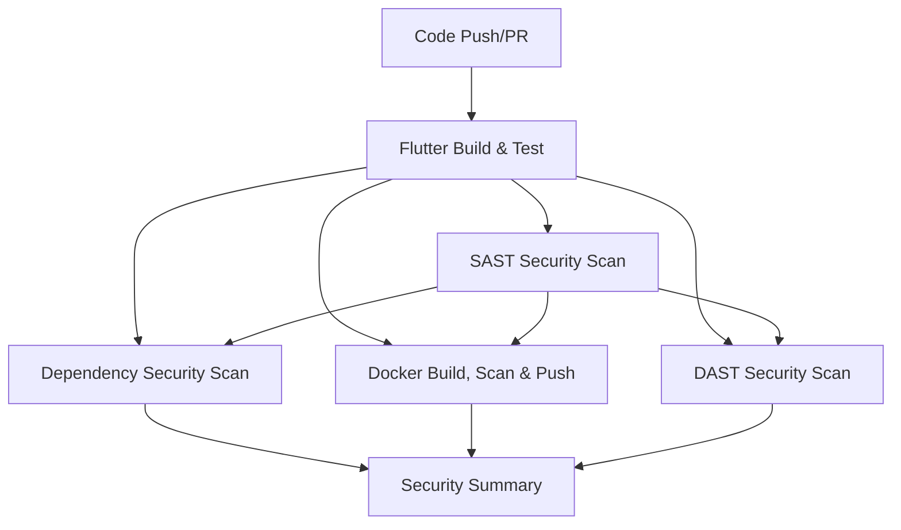

# CI/CD Flutter Project

A comprehensive Flutter project with automated CI/CD pipeline, security scanning, and containerization.

## 🚀 CI/CD Pipeline Overview

This project implements a robust CI/CD pipeline using GitHub Actions that automatically builds, tests, scans for security vulnerabilities, and deploys the Flutter application across multiple platforms.

### Pipeline Triggers
- **Push to main branch**: Automatic pipeline execution
- **Pull requests to main**: Validation and testing
- **Manual trigger**: On-demand execution via `workflow_dispatch`

### Pipeline Architecture

The CI/CD pipeline consists of 6 main jobs that run in parallel and sequential order:



## 🔧 Pipeline Jobs

### 1. Flutter Build & Test (`flutter-build-test`)
**Purpose**: Core Flutter application building and testing
- **Runtime**: Ubuntu Latest
- **Flutter Version**: 3.35.5
- **Dart Version**: 3.8.1

**Steps**:
1. **Repository Checkout**: Downloads the latest code
2. **Flutter Setup**: Installs Flutter SDK and verifies installation
3. **Dependency Caching**: Caches Flutter dependencies for faster builds
4. **Dependency Installation**: Runs `flutter pub get`
5. **Code Analysis**: Executes `flutter analyze` for code quality
6. **Testing**: Runs tests with coverage using `flutter test --coverage`
7. **Multi-Platform Builds**:
   - Android APK (`flutter build apk --release`)
   - Web application (`flutter build web --release`)
8. **Artifact Upload**: Stores build artifacts for subsequent jobs

### 2. SAST Security Scan (`sast-scan`)
**Purpose**: Static Application Security Testing using Semgrep
- **Dependencies**: Requires `flutter-build-test` to complete
- **Tool**: Semgrep with CI configuration rules

**Steps**:
1. **Repository Checkout**: Downloads source code
2. **Python Setup**: Installs Python 3.x
3. **Semgrep Installation**: Installs Semgrep security scanner
4. **Security Scanning**: Scans code for vulnerabilities using `semgrep --config p/ci`
5. **SARIF Upload**: Uploads results to GitHub Security tab

### 3. Dependency Security Scan (`dependency-scan`)
**Purpose**: Scans project dependencies for known vulnerabilities
- **Dependencies**: Requires both `flutter-build-test` and `sast-scan`
- **Tool**: Trivy for filesystem scanning

**Steps**:
1. **Repository Checkout**: Downloads source code
2. **Trivy Scanning**: Scans filesystem for dependency vulnerabilities
3. **Severity Filter**: Focuses on HIGH and CRITICAL vulnerabilities
4. **SARIF Upload**: Reports findings to GitHub Security tab

### 4. Docker Build, Scan & Push (`docker-build-scan-push`)
**Purpose**: Containerizes the Flutter web app and pushes to Docker Hub
- **Dependencies**: Requires `flutter-build-test` and `sast-scan`
- **Platforms**: Linux AMD64 and ARM64

**Steps**:
1. **Repository Checkout**: Downloads source code
2. **Artifact Download**: Retrieves Flutter build artifacts
3. **Docker Buildx Setup**: Configures multi-platform builds
4. **Docker Hub Login**: Authenticates using secrets
5. **Multi-Platform Build**: Builds for AMD64 and ARM64 architectures
6. **Docker Push**: Pushes images with commit SHA and latest tags
7. **Docker Caching**: Implements aggressive layer caching for performance
8. **Image Security Scan**: Scans built Docker image with Trivy
9. **SARIF Upload**: Reports container vulnerabilities

**Docker Images Created**:
- `{DOCKER_USERNAME}/flutter-app:{commit-sha}`
- `{DOCKER_USERNAME}/flutter-app:latest`

### 5. DAST Security Scan (`dast-scan`)
**Purpose**: Dynamic Application Security Testing (Manual trigger only)
- **Dependencies**: Requires `flutter-build-test` and `sast-scan`
- **Trigger**: Manual execution only via `workflow_dispatch`

**Implementation**: Placeholder for OWASP ZAP integration
- Future enhancement for runtime security testing
- Will scan deployed application for vulnerabilities

### 6. Security Summary (`security-summary`)
**Purpose**: Aggregates and reports all security scan results
- **Dependencies**: All security scans
- **Execution**: Always runs regardless of previous job results

**Output**: Comprehensive security dashboard with:
- Scan status for each security tool
- Performance optimization summary
- Security findings overview

## 🐳 Containerization

### Dockerfile Structure
The project uses a multi-stage Docker build:

1. **Build Stage**: Uses official Flutter image
   - Installs dependencies
   - Builds Flutter web application
   
2. **Runtime Stage**: Uses Nginx Alpine
   - Serves the built Flutter web app
   - Includes optimized nginx configuration

### Nginx Configuration
- **Port**: 80 (HTTP)
- **Routing**: Handles Flutter web app routing with fallback to `index.html`
- **Caching**: 1-year cache for static assets
- **Security Headers**: X-Frame-Options, X-Content-Type-Options, X-XSS-Protection

## 🔒 Security Features

### Security Scanning Stack
- **SAST**: Semgrep for static code analysis
- **Dependency Scanning**: Trivy for vulnerability detection
- **Container Scanning**: Trivy for Docker image security
- **DAST**: OWASP ZAP integration (planned)

### Security Reporting
- All scan results uploaded to GitHub Security tab
- SARIF format for standardized reporting
- Comprehensive security summary dashboard

## ⚡ Performance Optimizations

### Caching Strategy
- **Flutter Dependencies**: Cached using `pubspec.lock` hash
- **Docker Layers**: Aggressive multi-level caching
- **Build Artifacts**: Reused across jobs

### Build Efficiency
- **Parallel Execution**: Independent jobs run simultaneously
- **Multi-Platform**: Single build for AMD64 and ARM64
- **Artifact Reuse**: Build outputs shared between jobs

## 🚀 Getting Started

### Prerequisites
- Flutter SDK 3.35.5+
- Dart SDK 3.8.1+
- Docker (for local containerization)
- GitHub repository with Actions enabled

### Required Secrets
Configure these secrets in your GitHub repository:
- `DOCKER_USERNAME`: Your Docker Hub username
- `DOCKER_PASSWORD`: Your Docker Hub password/token

### Local Development
```bash
# Install dependencies
flutter pub get

# Run tests
flutter test

# Build for web
flutter build web --release

# Build Docker image locally
docker build -t flutter-app .
```

### Manual Pipeline Trigger
1. Go to Actions tab in GitHub
2. Select "Flutter CI/CD with Security Scanning"
3. Click "Run workflow"
4. Choose branch and click "Run workflow"

## 📊 Monitoring & Observability

### Build Status
- Real-time job status in GitHub Actions
- Detailed logs for each pipeline step
- Artifact downloads for build outputs

### Security Monitoring
- GitHub Security tab integration
- SARIF report analysis
- Vulnerability tracking and remediation

### Performance Metrics
- Build time optimization
- Cache hit rates
- Resource utilization tracking

## 🔧 Configuration

### Environment Variables
- `FLUTTER_VERSION`: 3.35.5
- `DART_VERSION`: 3.8.1

### Workflow Permissions
- `security-events: write`: For security scan reporting
- `contents: read`: For repository access

## 📚 Additional Resources

- [Flutter Documentation](https://docs.flutter.dev/)
- [GitHub Actions Documentation](https://docs.github.com/en/actions)
- [Docker Documentation](https://docs.docker.com/)
- [Semgrep Documentation](https://semgrep.dev/docs/)
- [Trivy Documentation](https://aquasecurity.github.io/trivy/)
